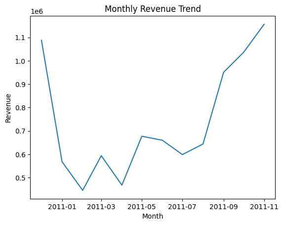

# Retail Analysis of 500,000+ retail transactions to evaluate revenue trends and customer concentration with SQL and Python.

This project analyzes over 500,000 retail transaction data to investigate revenue trends, customer concentration, and country-level performance using SQL and Python. The process involves data cleaning, summarizing the data into new columns, visualizing and interpreting the results to get valuable insights.

These are the main take-away points from this analysis:
1. The monthly revenue experienced a significant fall in the beginning of 2011, but maintained an uptrend throughout the whole year, and reached strong growth at the end of the year.
2. Monthly revenue growth fluctuates between the zero growth line, despite the general upward trend.
3. The United Kingdom made up for the majority of total revenue, indicating strong purchasing power.
4. The top 10 customers account for approximately 17% of total revenue, suggesting moderate customer concentration.
5. Customer spending distribution is heavily right-skewed, showing that most customers are low-to-moderate spenders.
6. Average order value stays relatively stable across the dataset.

## Monthly Revenue Trend

## Customer Spending

## Growth Rate

## Dataset

This project uses the **Online Retail Dataset** (UK retail transactions), publicly available on Kaggle. The dataset contains 500,000+ invoice-level transactions from a UK online retailer, including:

- Invoice number  
- Stock code  
- Product description  
- Quantity  
- Unit price  
- Customer ID  
- Country  
- Invoice date  

Dataset source:  https://www.kaggle.com/datasets/ulrikthygepedersen/online-retail-dataset
